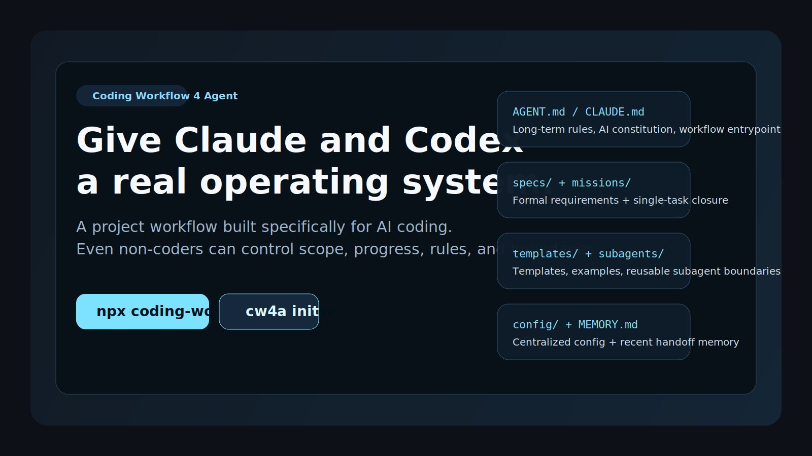
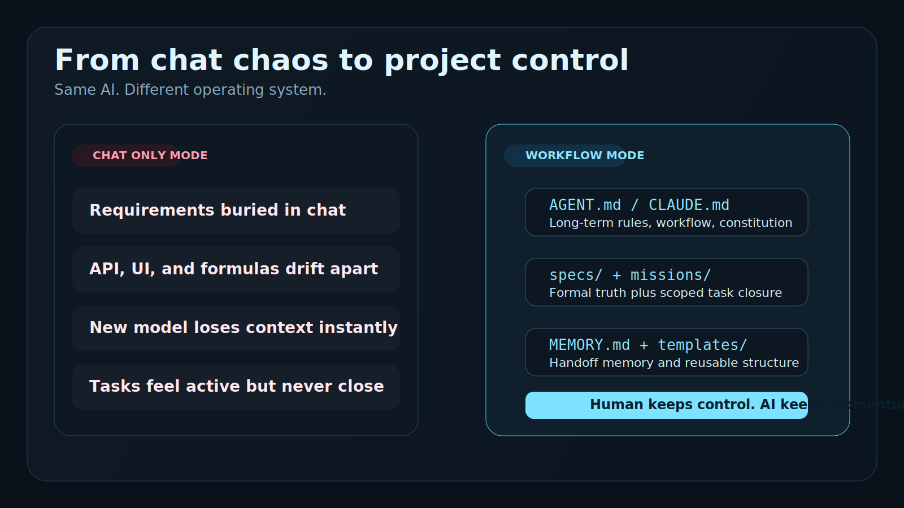
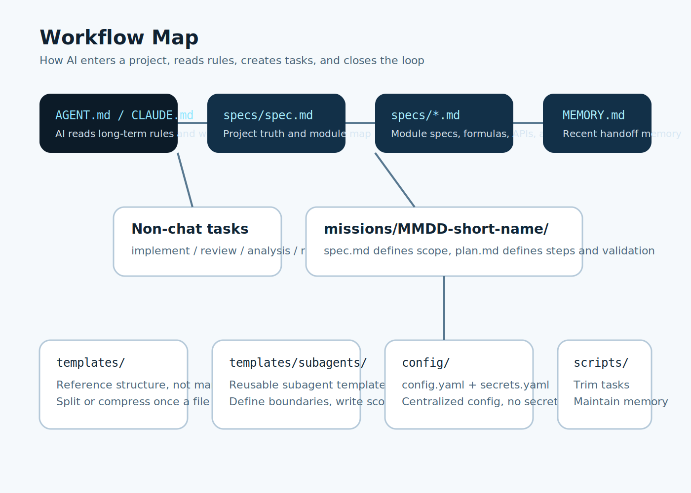
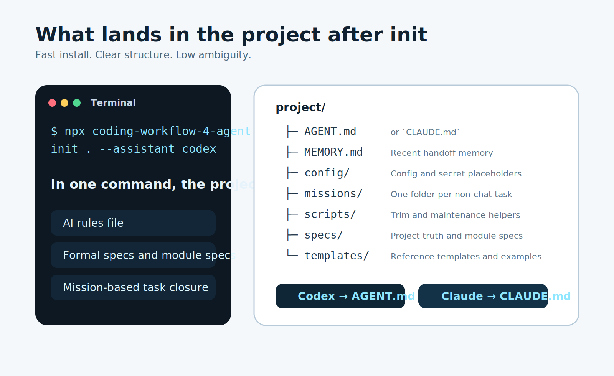

# Coding Workflow 4 Agent

<div align="center">

[](#english)
[](#chinese)
[](#quick-start)
[](./LICENSE)
[](#why-it-hits)

</div>



<div align="center">
  <strong>Give Claude and Codex a real project operating system.</strong><br />
  Specs. Missions. Memory. Config. Subagent templates.<br />
  So even non-coders can keep AI projects under control.
</div>

## Choose Your Language

| Entry | Jump |
| --- | --- |
| 🇺🇸 English | [Open English](#english) |
| 🇨🇳 中文 | [打开中文](#chinese) |

## Why It Hits

| 😵 Without a workflow | 😎 With Coding Workflow 4 Agent |
| --- | --- |
| Requirements disappear into chat history | Rules and specs become real project files |
| Claude and Codex re-learn the project every session | New sessions re-enter through `AGENT.md` or `CLAUDE.md` |
| Specs, APIs, formulas, and outputs drift apart | Formal specs keep one source of truth |
| Tasks start fast and end vaguely | Every non-chat task can close through a `mission` |
| Context lives in scattered chats | `MEMORY.md` keeps short handoff memory |
| Subagents speed up and then collide | Templates define clear scope and boundaries |





## Quick Start

| Goal | Command |
| --- | --- |
| Start with Codex | `npx coding-workflow-4-agent init . --assistant codex` |
| Start with Claude | `npx coding-workflow-4-agent init . --assistant claude` |
| Install globally | `npm install -g coding-workflow-4-agent` |

## What `init` Drops Into Your Project

```text
project/
├─ AGENT.md or CLAUDE.md
├─ MEMORY.md
├─ config/
├─ missions/
├─ scripts/
├─ specs/
└─ templates/
```



| File / Folder | What it does |
| --- | --- |
| `AGENT.md` / `CLAUDE.md` | Long-term AI rules and workflow entry |
| `specs/` | Formal project and module specs |
| `missions/` | Short-lived task scope and closure |
| `MEMORY.md` | Rolling handoff memory |
| `config/` | Shared config and secret placeholders |
| `templates/` | Reference templates and examples |
| `scripts/` | Simple maintenance helpers |

---

<a id="english"></a>

## English

### What This Is

Most AI coding projects do not fail because the model is weak.  
They fail because the project has no operating system.

**Coding Workflow 4 Agent** is a reusable workflow layer for AI-built software projects.

It is not:

- not a prompt pack
- not a boilerplate app
- not a forced code architecture

It is:

- a rules file for the assistant
- a formal spec system
- a mission system for non-chat work
- a rolling memory file for handoff
- a template system for repeatable structure

### What Makes It Different

| Layer | Why it matters |
| --- | --- |
| `specs/` | Real specs can define APIs, formulas, filters, lists, fields, outputs, and acceptance rules |
| `missions/` | Implementation, review, analysis, and requirement-change work all get a scope and a close |
| `MEMORY.md` | New AI sessions do not start from zero |
| `templates/` | AI gets a structure to follow without being forced to copy text mechanically |
| `subagents` templates | Repeated side-work can become reusable specialist templates |

### What Problem It Solves

| Common mess | Workflow answer |
| --- | --- |
| "The AI forgot what we decided" | Put the decision into specs or memory |
| "The API and UI describe different rules" | Formal specs define one contract |
| "The task is half-done but nobody knows the boundary" | Put it in a mission with `spec.md` and `plan.md` |
| "A new model lost all context" | Re-entry starts from the workflow files |
| "Too many subagents touched the same area" | Templates define write scope and no-overlap rules |

### Quick Start

#### Run directly

```bash
npx coding-workflow-4-agent init . --assistant codex
```

or

```bash
npx coding-workflow-4-agent init . --assistant claude
```

#### Install globally

```bash
npm install -g coding-workflow-4-agent
```

then

```bash
cw4a init . --assistant codex
```

### Assistant Output

| Assistant | Generated file |
| --- | --- |
| Codex | `AGENT.md` |
| Claude | `CLAUDE.md` |

### Good Fit / Bad Fit

| Good fit ✅ | Bad fit ❌ |
| --- | --- |
| Non-technical founders who still want control | People who want AI to improvise everything from chat only |
| Products with rules, formulas, APIs, outputs, and validation | Tiny throwaway scripts with no continuity |
| Teams switching between Claude and Codex | Teams that never reuse project context |
| Projects where task closure matters | Work that does not need specs or handoff memory |

### Design Principles

- Keep workflow files small, readable, and reusable
- Treat templates as references, not compulsory copy-paste
- Split large specs before they become unreadable
- Keep secret values out of markdown
- Let AI move fast, but only inside visible boundaries

### The Pitch in One Line

> If AI is writing the code, this workflow helps humans keep the wheel.

---

<a id="chinese"></a>

## 中文

### 这是什么

大多数 AI 编码项目失控，不是因为模型不够强，而是因为项目没有一套真正的工作流。

**Coding Workflow 4 Agent** 不是提示词包，不是脚手架，也不是强行规定代码目录结构。  
它是一层给 AI 项目使用的“项目操作系统”。

它把这些东西固定下来：

- AI 长期规则文件
- 正式需求和模块 spec
- 非闲聊任务的 mission 闭环
- 跨会话的记忆文件
- 可复用模板

### 它解决什么问题

| 常见问题 | 这套工作流怎么解决 |
| --- | --- |
| AI 每次开新会话都像失忆 | 从 `AGENT.md` 或 `CLAUDE.md` 重新进入项目 |
| 页面、接口、公式、输出口径越写越乱 | 用 `specs/` 固定正式口径 |
| 任务做了一半，边界不清，没人知道算不算完成 | 用 `missions/` 写清范围、步骤、验证 |
| 换 Claude 或 Codex 就掉上下文 | 用 `MEMORY.md` 做短期交接 |
| 子代理越开越多，最后互相打架 | 用模板约束职责、输入输出、写入边界 |

### 为什么它更适合复杂项目

这套 workflow 的 spec 不是空泛需求文档。  
它可以明确写：

- API 定义
- 字段定义
- 公式定义
- 筛选规则
- 列表定义
- 外部输出规则
- 验收标准

这对监控、套利、量化、报表、后台系统这类项目很重要。  
因为很多时候，**公式和接口本身就是需求的一部分**。

### 快速开始

#### 直接使用

```bash
npx coding-workflow-4-agent init . --assistant codex
```

或者

```bash
npx coding-workflow-4-agent init . --assistant claude
```

#### 全局安装

```bash
npm install -g coding-workflow-4-agent
```

然后

```bash
cw4a init . --assistant codex
```

### 初始化后会得到什么

| 内容 | 作用 |
| --- | --- |
| `AGENT.md` / `CLAUDE.md` | AI 的长期规则与工作流入口 |
| `specs/` | 项目总 spec 与模块 spec |
| `missions/` | 每次非闲聊任务的闭环容器 |
| `MEMORY.md` | 最近项目记忆与交接信息 |
| `config/` | 非敏感配置与敏感信息占位 |
| `templates/` | 模板与案例 |
| `scripts/` | 轻量维护脚本 |

### 适合谁

| 适合 ✅ | 不适合 ❌ |
| --- | --- |
| 不懂代码但想掌控项目的人 | 只想靠聊天让 AI 自由发挥的人 |
| 需求复杂、规则多、验证严格的项目 | 一次性小脚本 |
| 经常切换 Claude / Codex 的团队 | 不需要沉淀上下文的临时任务 |
| 希望项目文件井井有条的人 | 完全不想写 spec 或记录的人 |

### 一句话总结

> 如果代码主要由 AI 来写，那人就更需要一套能看得懂、管得住、可复用的工作流。
